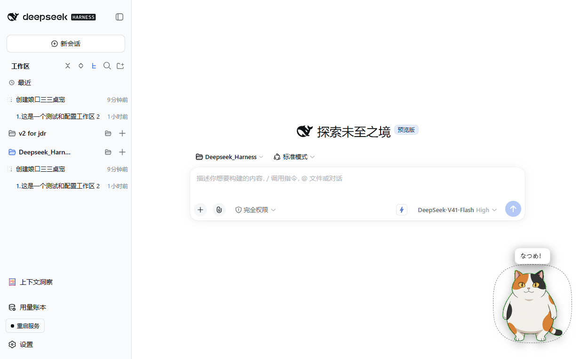
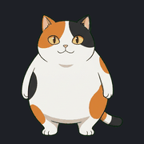
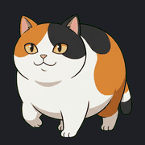
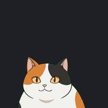

<div align="center">

# dsh-nyanko-sensei

**A round calico cat desktop pet that lives in the DeepSeek Harness Web GUI.**

[](https://github.com/Qihang-He/dsh-nyanko-sensei)
[](https://github.com/Qihang-He/dsh-nyanko-sensei)
[](LICENSE)
[](https://github.com/deepseek-ai)
[](#installation)

[中文说明](README.md)

</div>

---

Nyanko-sensei — 娘口三三, the fat calico cat from *Natsume's Book of Friends* — is now a resident of your DSH Web GUI. It dozes in a corner, yawns, naps, wanders around, yelps indignantly (or smugly) when you click it, bounces off the walls when you fling it, and changes its mood to match what your agent is doing.

It is a pure front-end pet: **it patches nothing in the DSH tree** and occupies no UI slot, so uninstalling it leaves no trace in the interface.

## Preview

How it looks in a real page (captured by the end-to-end run in [`tools/verify-browser.mjs`](tools/verify-browser.mjs), not staged by hand):



Twelve actions are declared in code (see [How it works](#how-it-works)). Preview GIFs are generated per action by the asset pipeline, and three of them are built in the repository today:

| Action | Preview |
| --- | --- |
| `idle` standing, breathing |  |
| `walk` walking |  |
| `sit` sitting |  |

The sprite-sheet prompts for the remaining actions are already written in the `ACTIONS` table of [`tools/gen_art.py`](tools/gen_art.py); running the full pipeline fills them in:

```bash
python tools/gen_art.py actions
python tools/build_assets.py all
```

That produces `assets/anims/<action>.webm` and `docs/preview/<action>.gif` together.

> Action assets build incrementally: whichever action is missing from `assets/anims/` is skipped and falls back to `idle`, and the pet itself keeps working.

## Installation

The plugin ships as an npm package on GitHub and installs into the `web` profile through DSH's plugin management command.

### From GitHub (recommended)

```bash
dsh plugin --profile web add github:Qihang-He/dsh-nyanko-sensei
dsh web
```

The second command matters: the plugin row and the browser bundle are loaded when the process starts, so a page refresh is not enough — you have to restart `dsh web`.

### From source (local path)

```bash
git clone https://github.com/Qihang-He/dsh-nyanko-sensei.git
cd dsh-nyanko-sensei
dsh plugin --profile web add .
dsh web
```

`add .` installs the current directory, so `cd` into the repository root (the one holding `package.json`) first, or pnpm will look for a different package.

### Updating

```bash
dsh plugin --profile web add github:Qihang-He/dsh-nyanko-sensei
dsh web
```

GitHub dependencies resolve by commit, so re-running `add` pulls the current version. For a source install, `git pull` in the checkout and restart `dsh web`.

### Uninstalling

```bash
dsh plugin --profile web remove dsh-nyanko-sensei
dsh web
```

Settings are not removed. To clear those too, run `localStorage.removeItem("dsh-nyanko-sensei:settings")` in the browser console. Any voice files you recorded live in your user directory (see [Voice](#voice)) and must be deleted by hand.

### ⚠️ Keep exactly one install source

Do **not** install the same plugin twice — once from GitHub and once from a local path. With both records in the `web` profile's dependencies the plugin row appears twice, and DSH fails while resolving the duplicate entry, which means the server does not come up.

To get back to a single source:

```bash
dsh plugin --profile web remove dsh-nyanko-sensei
dsh plugin --profile web add github:Qihang-He/dsh-nyanko-sensei
dsh web
```

## Using the pet

Once loaded, the cat appears in the bottom-right corner (180 px by default; adjustable in the settings panel).

| Action | What happens | Implementation |
| --- | --- | --- |
| **Left click** | Plays one of `happy` / `angry` / `surprised` / `eat` / `beast` at random, speaks a voice clip, and marks the pet as selected (dashed ring) | `clickReaction()` in [`lib/client.js`](lib/client.js) |
| **Click the head** (top 42% of the sprite) | Additionally has a 50% chance to mutter a happy line | same, `region === "head"` |
| **Click the tail** (right 32%) | Additionally has a 50% chance to mutter a grumpy line | same, `region === "tail"` |
| **Hold and drag** | Plays `drag` (legs dangling, squirming); releasing after more than 4 px counts as a drag and does not fire a click | `bindGlobal()` / `pointermove` |
| **Fling it** | It flies with inertia, bounces off the viewport edges with a 0.55 restitution, and settles back into `happy` | the inertia block in `step()` |
| **Click to select, then click elsewhere** | The cat walks to that spot, playing `walk`, flipping to face the direction of travel | `startWalkTo()` |
| **Right click** | Opens the quick menu (items below) | `openMenu()` |
| **Idle chatter** | Speech bubbles drawn from the `LINES` table, at a rate set by the activity level | `autonomyStep()` |
| **Wandering** | When the idle timer fires it picks a new position at random, with a probability per activity level | `scheduleAutonomy()` |
| **Window resize** | Its position is clamped back into the viewport, so it cannot be left off-screen | the `resize` listener |
| **Agent awareness** | Reacts to "generating / waiting for approval / error / done" with a matching animation and line | `watchAgent()` / `detectBusy()` |
| **OS "reduce motion"** | Turns off the cross-fade and the walking bob | `reducedMotion()` |

### Right-click quick menu

| Item | Behaviour |
| --- | --- |
| 呼唤「なつめ」 (call "Natsume") | Speaks the click voice clip (`natsume` by default), plays `happy`, shows the bubble "なつめ！"; greyed out when no such clip exists |
| 摸摸头 (pat) | Plays `happy` |
| 变身 (transform) | Plays `beast` — the giant white beast form — with a line to match |
| 睡一会儿 (nap) | Forces `sleep` |
| 散步 (walk) | Picks a random x position and walks there |
| 大小 NNNpx ( + / − ) | Grows the pet by 20 px per click, clamped to 80–420 |
| 显示 / 隐藏 (show / hide) | Toggles visibility and persists it |
| 回到初始位置 (reset position) | Clears velocity and returns to the configured corner |
| 打开完整设置… (open full settings) | Opens the settings panel on the right |

> The size item only ever grows by 20 px per click and stops at the upper bound. Use the slider in the settings panel for precise control.

## How it works

### The animation machine

`ANIMS` in `lib/client.js` defines twelve actions. All of them use the same format — **VP9 WebM with an alpha plane, on a 360×360 canvas**. The table lists the full set the client declares; `idle`, `walk` and `sit` have asset files today, while the rest have prompts but no built assets yet, in which case the client skips them and falls back to `idle` (see [Preview](#preview)):

| Action | Kind | Duration | Notes |
| --- | --- | --- | --- |
| `idle` | loop | — | standing, breathing |
| `blink` | one-shot | 420 ms | returns to `idle` |
| `walk` | loop | — | used while moving |
| `sit` | loop | — | sitting upright |
| `yawn` | one-shot | 1400 ms | returns to `idle` |
| `sleep` | loop | — | curled up asleep |
| `happy` | one-shot | 1200 ms | returns to `idle` |
| `angry` | one-shot | 1200 ms | returns to `idle` |
| `surprised` | one-shot | 1000 ms | also plays on wall impact |
| `eat` | one-shot | 1600 ms | rice ball |
| `drag` | loop | — | dangling while held |
| `beast` | one-shot | 2000 ms | huge white beast form |

One-shot actions return to `idle`. Three mechanisms guarantee that: the video's `ended` event, a `busyUntil` timeout in the animation machine, and a poll in `step()`. A video that never fires `ended` therefore cannot freeze the cat on its last frame.

Rendering uses **two `<video>` elements double-buffered**, so switching animations is a cross-fade rather than a flash of empty frame. If a file is missing from `assets/anims/`, that action is skipped and falls back to `idle`; the pet stays usable.

### Agent-activity awareness

The cat **observes DOM mutations in the conversation area** (a `MutationObserver` on `document.querySelector("main")`, falling back to `document.body`) to guess what you are doing. Be clear about what this is: **a heuristic read of the page, not an RPC subscription.**

- It debounces at 900 ms, so a burst of streaming updates cannot thrash it.
- A state must hold steady for 1200 ms before it is accepted (hysteresis), which suppresses flicker.
- The signal is the last 4000 characters of the page's text, matched against a few keyword groups: `停止 / Stop` → working, `允许 / 拒绝 / Approve / Deny / 等待批准` → waiting for you, `出错 / 失败 / Error / Failed` → error, `完成 / Done / Finished` → done.

The resulting reactions:

| Detected state | Animation | Line (with probability) |
| --- | --- | --- |
| Working | `walk` | `work` at 18% |
| Waiting for approval | `sit` | `waiting` at 30% |
| Error | `surprised` | `fail` at 70% |
| Done | `happy` | `done` at 60% |

It watches the DOM instead of subscribing to host events on purpose: **it needs no host API, does not depend on the GUI's internals, and its failure mode is "no signal" rather than an error** — with no signal, the pet simply behaves autonomously. You can turn the whole thing off with the "follow agent state" setting.

### Autonomy and activity levels

The `ACTIVITY` table defines three profiles, exposed as the "activity" setting:

| Level | Idle interval | Wander chance | Chatter chance |
| --- | --- | --- | --- |
| `quiet` | 14–30 s | 12% | 0% |
| `balanced` (default) | 7–16 s | 30% | 5% |
| `lively` | 3.5–8 s | 50% | 14% |

When the timer fires it rolls for a wander first, then for a chatter line paired with a `happy` / `angry` / `surprised` reaction, and otherwise picks a new resting pose. The resting pool is `idle` (weighted three times), `sit`, `blink`, `sleep`, `yawn` and `walk`. Autonomy is skipped while the pet is being dragged or while its menu or settings panel is open.

### Speech bubbles

With bubbles enabled, a line from the `LINES` table shows above the cat's head for `bubbleMs` milliseconds (4200 by default). Lines are grouped by mood: `greet`, `happy`, `angry`, `sleepy`, `work`, `done`, `fail`, `waiting`, `beast`. Bubbles are coloured with DSH theme variables, so they follow light and dark themes.

### Reduced motion

When the system reports `prefers-reduced-motion: reduce`:

- the cross-fade between animations is dropped and frames switch instantly;
- the walking bob is removed, leaving plain translation;
- fling inertia is disabled, so releasing the pet drops it in place.

The preference is sampled live, so changing it in the OS does not require reloading the page.

## Settings

Settings live in `localStorage` under `dsh-nyanko-sensei:settings` and are **edited through the pet's own UI** (right click → open full settings). There is no DSH settings card for this plugin.

| Field | Meaning | Default |
| --- | --- | --- |
| `visible` | Whether the pet is shown | `true` |
| `size` | Sprite edge length in px; the panel slider spans 80–420 | `180` |
| `corner` | Starting corner: `bottom-right` / `bottom-left` / `top-right` / `top-left` | `"bottom-right"` |
| `marginX` | Horizontal inset from the edge on first placement (px) | `28` |
| `marginY` | Vertical inset from the edge on first placement (px) | `28` |
| `speed` | Movement-speed parameter | `60` |
| `activity` | Activity level: `quiet` / `balanced` / `lively` | `"balanced"` |
| `voiceEnabled` | Whether voice clips play | `true` |
| `voiceVolume` | Volume; the 0–100 slider maps to 0–1 | `0.9` |
| `voicePack` | Which voice pack directory to use | `"default"` |
| `clickVoice` | Clip id preferred on click | `"natsume"` |
| `bubbles` | Whether speech bubbles are shown | `true` |
| `bubbleMs` | How long a bubble stays up (ms) | `4200` |
| `reactToAgent` | Whether to follow agent activity | `true` |
| `wander` | Whether autonomous wandering is allowed | `true` |
| `showSettingsHint` | Toggle for the settings-panel hint text | `true` |

> `corner`, `marginX` and `marginY` apply on page load and on "reset position" only; otherwise the cat stays wherever you last left it.
> `speed` and `showSettingsHint` are reserved fields not yet wired up in this version: they persist, but no control edits them and changing them does not alter behaviour today.

The panel has a "restore defaults" button at the bottom that resets every field above.

## Voice

**Read this section carefully — the plugin ships no original anime audio.**

### What a click actually does

Clicking the pet tries to play the clip whose id is **`natsume`** (set by `DEFAULTS.clickVoice`, changeable in the settings panel).

If no such clip exists, nothing happens: no error, no dialog, just the animation. The quick-menu item "呼唤「なつめ」" is greyed out in that case.

### The repository only carries synthetic placeholders

`assets/voice/` does contain seven MP3 files (`natsume`, `happy`, `angry`, `surprised`, `eat`, `purr`, `sleep`), and every one of them is **synthesised in code by [`tools/gen_voice.py`](tools/gen_voice.py)**: a glottal pulse train shaped by two resonant formants, with an amplitude envelope and a little breath noise. It is a stylised cartoon meow, deliberately unlike a human voice actor.

**They are not the original recordings, and they cannot be** — that audio is a commercial recording this plugin has no right to redistribute, so all it ships is something that makes the click-to-speak path audible and testable.

### Supplying your own audio

The host half serves media from two roots and **the user root takes precedence over the packaged assets**, so dropping in a file of the same name overrides it with no rebuild and no edits to the package:

```
<user root>\voice\<pack>\<clip id>.<ext>
```

On Windows `DSH_HOME` defaults to `%USERPROFILE%\.dsh`, so the common case looks like:

```
%USERPROFILE%\.dsh\dsh-nyanko-sensei\voice\custom\natsume.mp3
```

- Files directly under the `voice\` root belong to the pack named `default`.
- Files inside `voice\<subdir>\` form a pack named after that subdirectory — `custom` above — which you then pick in the settings panel's voice-pack dropdown.
- The file name without its extension is the **clip id**: `natsume.mp3` provides the clip `natsume`.
- After adding audio, **refresh the browser page**; no `dsh web` restart is needed (the host re-reads the disk on each request and the manifest is served with `no-store`).

Supported extensions: `mp3`, `m4a`, `aac`, `ogg`, `oga`, `opus`, `wav`, `flac`. When the same clip exists in several formats, the first in that order wins.

Recognised clip ids: `natsume`, `happy`, `angry`, `surprised`, `eat`, `purr`, `sleep`. The `happy` animation carries `["natsume", "happy"]` as its voice list; every other action speaks its own id.

### Recording a take with a microphone

[`tools/record-voice.ps1`](tools/record-voice.ps1) records from your mic, trims the silence around the take, normalises the level, and writes the result straight into a user voice pack.

List the recording devices ffmpeg can see:

```powershell
pwsh -File tools/record-voice.ps1 -ListDevices
```

With exactly one device it is selected automatically, so you can just record:

```powershell
pwsh -File tools/record-voice.ps1 -Seconds 6
```

With several, name one (copy it verbatim from the list):

```powershell
pwsh -File tools/record-voice.ps1 -Device "Microphone (Realtek(R) Audio)" -Seconds 6 -Clip natsume -Pack custom
```

You get a three-second countdown, and pressing Enter stops early. The take lands at `%USERPROFILE%\.dsh\dsh-nyanko-sensei\voice\custom\natsume.mp3`. Parameters: `-Clip` (default `natsume`), `-Seconds` (default 8), `-Device`, `-Pack` (default `custom`). The script needs ffmpeg on `PATH`.

There is an npm alias too:

```bash
npm run voice:record
```

### ⚠️ You are responsible for the audio you supply

**Whatever you put into a voice pack is your responsibility.** If you cut a line out of the anime, or extract a fragment from any commercial film, record or stream, that is a copyrighted recording: keep it for personal use on your own machine and **do not publish, commit or redistribute that file with the plugin or through any other channel**. The plugin's authors do not and will not distribute such audio.

## Provenance and licensing

Three quite different kinds of thing live in this repository; please treat them separately.

- **Code** — [`lib/index.js`](lib/index.js), [`lib/client.js`](lib/client.js) and everything under [`tools/`](tools) is MIT licensed. See [LICENSE](LICENSE).
- **Artwork** — the animation sets in `assets/anims/` were generated by [`tools/gen_art.py`](tools/gen_art.py) through the OfoxAI relay using Google Gemini image models, from the prompts recorded in that script (the `CHAR`, `BEAST` and `ACTIONS` tables). Intermediates live in `work/`. **Every frame was made for this project; no screenshots or official assets were used.**
- **Voice** — the placeholder clips in `assets/voice/` are produced purely in code by [`tools/gen_voice.py`](tools/gen_voice.py) and contain no third-party recording.

**Nyanko-sensei / 娘口三三 / ニャンコ先生 is a character from *Natsume's Book of Friends*. This project is an unofficial fan work with no affiliation to, and no endorsement from, the rights holders of the original.** The character design belongs to its author and the relevant rights holders. If you hold those rights and object to the AI-generated likeness in this repository, please open an issue and we will address it.

The full provenance of every non-code file, including redistribution constraints, is in [THIRD_PARTY_ASSETS.md](THIRD_PARTY_ASSETS.md).

## Development

### The asset pipeline

All art and audio assets are script output. The order is:

```bash
# 0. (optional) style shortlist: the same character description through six image models, into work/candidates/
python tools/candidates.py

# 1. reference views and action sheets: one 2x2 sprite sheet per action, into work/views and work/sheets
python tools/gen_art.py sheet
python tools/gen_art.py actions          # or just a few: python tools/gen_art.py actions idle walk

# 2. chroma-key, align, encode WebM, render preview GIFs
python tools/build_assets.py all         # or frames / encode / preview individually

# 3. static self-check: does the client bundle parse, do the manifest's files exist,
#    does every animation the client names have an asset, does the host half import
node tools/check-package.mjs
```

`tools/build-all.cmd` chains every step except the shortlist, so it can simply be run on Windows.

The npm scripts are shorter aliases:

| Command | Equivalent to |
| --- | --- |
| `npm run art:views` | `python tools/gen_art.py sheet` |
| `npm run art:actions` | `python tools/gen_art.py actions` |
| `npm run art:build` | `python tools/build_assets.py all` |
| `npm run voice:record` | `pwsh -File tools/record-voice.ps1` |
| `npm run check` | `node tools/check-package.mjs` |

### The image stages need an OfoxAI credential

`gen_art.py` and `candidates.py` really do call an image-generation API, so they need an **OfoxAI API key**.

`tools/ofox.py` does not read that key from the environment, the command line or a config file. It reads it **from the DSH credential store**: the `refs.OFOX_API_KEY` entry in `$DSH_HOME/.credentials.yaml` (on Windows, `%USERPROFILE%\.dsh\.credentials.yaml`). The secret therefore never reaches a file, a command line or a log.

```yaml
refs:
  OFOX_API_KEY: "your key here"
```

Without a key the script exits immediately and prints the credential path. The pixel stage, `build_assets.py`, is local (Pillow + numpy + ffmpeg) and needs neither network nor key; ffmpeg must be on `PATH` or found under `D:\ffmpeg-*\bin\ffmpeg.exe`.

### Requirements

- **Node.js** `^22.19.0 || >=24.0.0` (see `engines` in `package.json`)
- **Python 3.10+**, for the asset pipeline only: `numpy`, `Pillow`, `requests`, `PyYAML`
- **ffmpeg / ffprobe**, for encoding and recording only

There is no browser build step — [`lib/client.js`](lib/client.js) is a hand-written `__ModuleLoader__` bundle in plain DOM with no framework, so it can be audited in one file and cannot break when the GUI's React tree changes shape.

## Repository layout

```
dsh-nyanko-sensei/
├── package.json               # package manifest: exports, dsh.bundle.patch, dsh.client
├── cordis.patch.yml           # bundle patch layer: inserts the plugin row into the web profile
├── lib/
│   ├── index.js               # host half: media route + manifest (requires the webServer service)
│   └── client.js              # browser half: the pet itself (animation machine, interaction, voice, autonomy)
├── assets/
│   ├── anims/                 # action assets: VP9-alpha WebM (360x360), produced by the pipeline
│   └── voice/                 # seven synthetic placeholder MP3s, overridable by the user
├── tools/
│   ├── ofox.py                # OfoxAI relay client; key comes from the DSH credential store
│   ├── candidates.py          # multi-model style shortlist
│   ├── gen_art.py             # stage 1: prompts -> 2x2 action sprite sheets
│   ├── build_assets.py        # stage 2: key + align -> frames -> WebM -> preview GIFs
│   ├── gen_voice.py           # synthesise the placeholder voice clips
│   ├── record-voice.ps1       # microphone take + trim + normalise
│   ├── check-package.mjs      # static self-check: bundle parses, assets complete
│   ├── verify-browser.mjs     # end-to-end: drives Edge over CDP against the real pet
│   └── build-all.cmd          # run the whole pipeline in one go
├── docs/
│   ├── screenshot.png         # runtime capture, written by verify-browser.mjs
│   └── preview/               # preview GIF output directory (written by art:build)
├── work/                      # intermediates (sheets, frames, shortlist); safe to delete
├── README.md                  # Chinese README
├── README.en.md               # this file
├── LICENSE                    # MIT + media assets note
└── THIRD_PARTY_ASSETS.md      # provenance and redistribution constraints for non-code files
```

Files on the user's side live in the DSH home, not in the package:

```
%USERPROFILE%\.dsh\dsh-nyanko-sensei\voice\<pack>\<clip id>.<ext>
```

## Troubleshooting

**The pet is not visible after installing**

1. Make sure you restarted with `dsh web` — the plugin row is loaded at process start, and refreshing the page alone is not enough.
2. Open the browser console and look for lines beginning `[dsh-nyanko-sensei]`. Without `pet awake at ...`, the browser bundle never loaded.
3. Check whether you hid it: right-click where the pet used to be, or clear `dsh-nyanko-sensei:settings` from `localStorage` and reload.
4. The pet's container is a full-viewport `position: fixed` layer with `z-index` 2147483000. If the page has an overlay above that, the cat sits underneath it.

**Clicking makes no sound**

This is **expected, not a bug** — the plugin ships only synthetic placeholder audio and no original voice line.

1. Check that "enable voice" is on and that the volume is not zero in the settings panel.
2. Look at the hint at the bottom of the settings panel: it lists the voice packs and clip counts it found. As long as the packaged `assets/voice/*.mp3` were discovered, it shows at least `default(7)`. If it says no voice files were found at all, the host's media roots are not reading the package — check that the plugin installed completely.
3. Put a `natsume.mp3` under `%USERPROFILE%\.dsh\dsh-nyanko-sensei\voice\` as described in [Voice](#voice), then refresh the page.
4. Browser autoplay policy can block audio that has no user gesture behind it. A click is a gesture, so ordinary use is fine, but script-triggered clicks right after load may be refused — the console will say so.
5. A greyed-out "呼唤「なつめ」" in the quick menu means the same thing: no `natsume` clip was found.

**Some animations never appear**

`assets/anims/` currently holds only three built actions — `idle`, `walk` and `sit` (see [Preview](#preview)). The prompts for the other nine are already in [`tools/gen_art.py`](tools/gen_art.py) but the assets have not been generated: the client skips an action whose file is missing and falls back to `idle`, so you get no error, just a pet with a smaller repertoire. To build them:

```bash
python tools/gen_art.py actions
python tools/build_assets.py all
```

**The pet has wandered off-screen**

Horizontal drag lets it overhang by about 30% of its width; vertical drag does not. After release, inertia pushes it back inside the bounds and it bounces.

If it is completely gone:

1. Resize the window once — the `resize` listener clamps the position back into view.
2. Right-click near a corner and hope, or just run this in the browser console:
   ```js
   localStorage.removeItem("dsh-nyanko-sensei:settings")
   ```
   then reload: it returns to the default bottom-right corner.

**The animation is opaque or has a black background (Safari)**

The animation assets are **VP9-encoded WebM with the alpha channel in a separate plane**. Safari still cannot decode VP9 alpha, so the video plays but the transparency is lost — the cat becomes a black or green box.

This is a codec limitation, not a playback bug. Workarounds:

- Use Chrome, Edge or Firefox for the DSH Web GUI.
- Or replace `assets/anims/*.webm` with alpha-capable HEVC/MP4. `animUrl()` in `lib/client.js` currently always requests `.webm`, so that one line needs changing to match.

**The pet vanished but the settings survived**

Settings live in `localStorage`, and uninstalling the plugin does not clear them. Reinstall and the size, position and voice pack carry over.

---

<div align="center">

This project is not affiliated with DeepSeek; it is a community open-source plugin for DeepSeek Harness.

</div>
